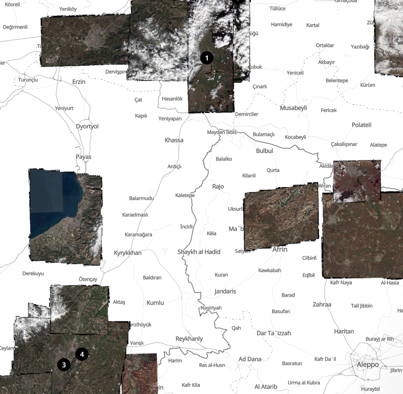

# Mosaic Tiler

A server that generates tiles containing all images present in OpenAerialMap.



## About

Mosaic tiler is a supplementary application that operates as an additional layer on top of a dynamic raster tiler. Its function is to combine and cache tiles from multiple images.

## Dependencies:

TiTIler
PostgreSQL with installed PostGIS

## Installation:

Please note that you are expected to have preinstalled TiTiler and PostgreSQL with ingested OAM images index.

```bash
git clone https://github.com/konturio/oam-mosaic-map
cd oam-mosaic-map
npm i
npm start
```

It is necessary to have the following environment variables properly set:
- `BASE_URL` is the root URL of the server.
- `TITILER_BASE_URL` is the URL of your Titiler installation.
- `TILES_CACHE_DIR_PATH` is the path for the tiles cache.
- `PGDATABASE`, `PORT`, `PGHOST`, `PGUSER` and `PGPASSWORD` are PostgreSQL-related variables.

## k8s

Ready Helm configuration for mosaic tiler:
https://github.com/konturio/disaster-ninja-cd/tree/main/helm/raster-tiler

## How does a mosaic tiler work:

When the Mosaic Tiler receives a request for a tile, it handles it in the following steps:
1. Query the list of geotiffs contained within the requested tile from the database. Using PostgreSQL with PostGIS allows delegating the handling of spatial queries from the tiler to PostGIS.
2. Process each of the contained images, either by requesting TiTiler to generate a tile for a geotiff or by retrieving a tile from the cache. It is important to note that the Mosaic Tiler does not handle geotiffs directly and instead delegates this responsibility entirely to TiTiler, focusing only on working with PNG and JPEG tile images.


3. Create the resulting mosaic tile by stacking the tiles of all contained images on top of each other in a specific order (currently, the images are sorted based on their resolution, with the highest quality images appearing at the top).
